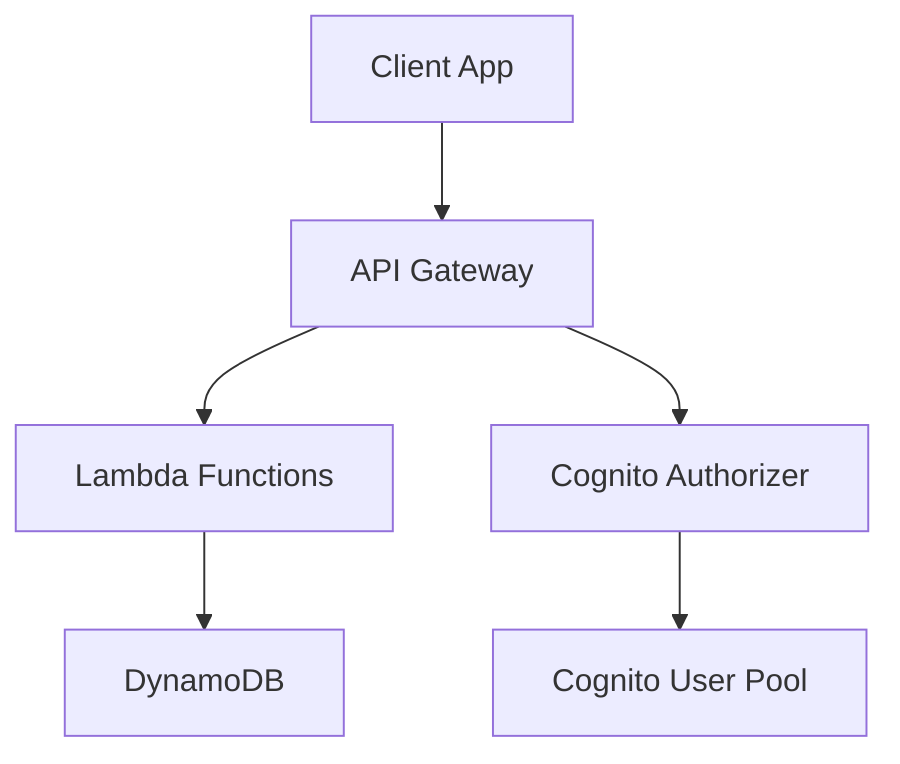

# 📝 ToDo SAM App

A fully serverless To-Do application built with AWS SAM, Cognito authentication, API Gateway, Lambda, and DynamoDB. Designed for recruiter-readiness, clarity, and production-grade infrastructure.

---

## 🚀 Features

- ✅ User signup and login via Cognito  
- 🔐 Authenticated CRUD operations on tasks  
- 🌐 RESTful API with CORS and JWT protection  
- 🧱 Modular Lambda handlers using AWS SDK v3  
- 🧼 Environment isolation, tagging, and retention policies  
- 🧪 Local development support with `sam local`  

---

<details>
<summary>🧱 Architecture Diagram (Click to expand)</summary>



</details>

---

<details>
<summary>📦 Folder Structure</summary>

```plaintext
todo-sam-app/
├── template.yaml
├── README.md
├── .gitignore
├── src/
│   └── handlers/
│       ├── createTask.js
│       ├── getTasks.js
│       ├── deleteTask.js
│       ├── updateTask.js
│       ├── completeTask.js
│       ├── signup.js
│       └── login.js
```

</details>

---

<details>
<summary>🛠️ Setup & Deployment</summary>

### Prerequisites
- AWS CLI configured  
- SAM CLI installed  
- Node.js 18+  

### Install dependencies
```bash
cd src/handlers/<function>
npm install
```

### Build and deploy
```bash
sam build
sam deploy --guided
```

</details>

---

<details>
<summary>🔐 Authentication Flow</summary>

- **Signup**: `POST /auth/signup`  
- **Login**: `POST /auth/login`  
- All `/tasks` routes require a valid JWT from Cognito  

</details>

---

<details>
<summary>📤 API Endpoints</summary>

| Method | Path                     | Auth Required | Description              |
|--------|--------------------------|---------------|--------------------------|
| POST   | `/auth/signup`           | ❌            | Create new user          |
| POST   | `/auth/login`            | ❌            | Authenticate user        |
| GET    | `/tasks`                 | ✅            | Get all tasks            |
| POST   | `/tasks`                 | ✅            | Create a task            |
| PUT    | `/tasks/{taskId}`        | ✅            | Update a task            |
| DELETE | `/tasks/{taskId}`        | ✅            | Delete a task            |
| PATCH  | `/tasks/{taskId}/toggle` | ✅            | Toggle task completion   |

</details>

---

<details>
<summary>📚 Notes</summary>

- All task routes are explicitly bound to `ServerlessRestApi` and protected by Cognito  
- `DeletionPolicy: Retain` ensures safe teardown  
- Uses AWS SDK v3 with modular imports for Lambda efficiency  
- IAM policies follow least-privilege principles  
- Local testing supported via `sam local invoke` and `sam local start-api`  

</details>

---

## 👨‍💻 Author

Built by **Abhishek** — passionate about clean infrastructure, recruiter-ready code, and serverless best practices.

- 💼 [LinkedIn](https://www.linkedin.com/in/abhishekgupta-2017)
- 🛠️ [GitHub](https://github.com/DevAbhishekGupta)
